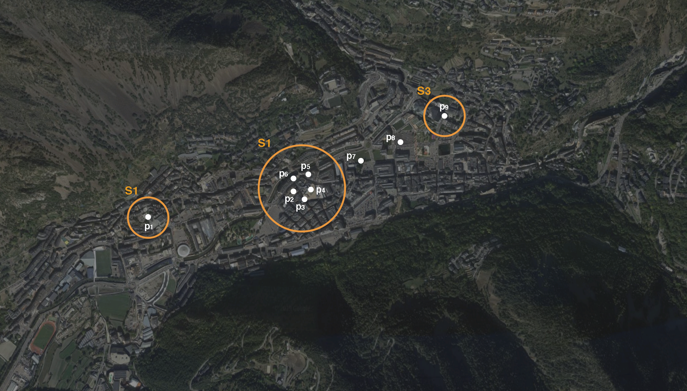

# AND-TourismWorkshop
**Carto**, **City Science Group** and the **Andorra Innovation Hub** are organising for the first time a workshop with the goal of explore and brainstorm new ways of analyzing spatial data to better understand tourist profiles.
This repo holds all the documentation in order to get and deal with the different datasets that will be provided for the workshop.

## DATA
Different datasets will be provided to carry out the workshop. The main dataset comes from **telecom data** and then other complementary datasets such as GIS layers, diccionaris,...

Run this to get all the data:
```sh
git clone https://github.com/actuatech/AND-TourismWorkshop.git
cd AND-TourismWorkshop
bash getData.sh
```

### Stay Points
Trabajar con todos los registros raw resulta muy ineficiente, por este motivo se ha implementado un [algoritmo](https://www.researchgate.net/publication/221589982_Mining_user_similarity_based_on_location_history) para calcular los diferentes stay points para cada uno de los usuarios. Así pues como se puede ver en la figura, agregamos los registros que cumplen con dos criterios **100meters** y **15min**.
These stays points then are correlated with the **Uber H3** cell index at a resolution level of **11**.




The final schema for this dataset is the following:

| Column | Type | Description |
| --- | --- | --- |
| **imsi** | String | Unique user identifier |
| **mcc** | Integer | Mobile country code |
| **mnc** | Integer | Mobile network code|
| **init_timestamp** | Timestamp | Initial timestamp of the stay point in the format **_yyyy-mm-dd HH:MM:SS_** and **UTC** time zone|
| **delta** | Float | Duration in minutes of stay |
| **latMean** | Float | Latitude of the centroid |
| **lonMean** | Float | Longitude of the centroid |
| **h3index** | String | H3 index at a resolution of 11 |

Three datasets have been generated for different days:
* **Normal Day** (19 Oct 2019)
* **LaVuelta Day** (1 Sept 2019)
* **CirqueDuSoleil** (13 Jul 2019)


### GIS
Different GIS layers in GeoJSON format are provided in order to cross spatial data with them.

##### Administrative limits
Known in Andorra as parishes, this GIS layer provides the administrative divisions of the country.


##### Buildings
All buildings inside the country are provided. However, we don't have more usefull information referring the buildings.

##### POIs
Different POIs are provided containing: restaurants, hotels, shops, museums,...


##### Land use/activity
We have created a land use/activity layer.

| Column | Type | Description |
| --- | --- | --- |
| **ObjectId** | Integer | Geometry identifier |
| **type** | String | Type of land |
| **zoneActivi** | String | Type of activity associated to land |
| **zoneName** | String | Zone name |

Types of land use can be:
* Mountain
* Natural Park
* No activity
* Ski resort
* Urban zone

Zones activities can be:
* Recreational Sport
* Commercial
* Industrial
* Residential
* Parking
* Mixed

### Others
Other datasets such the mcc and mnc relation with country names are provided to better understand telecom data.

##### MCC/MNC
This dataset allows to get the country names with the mcc and mnc codes.


## Libraries
#### Uber H3
[H3](https://eng.uber.com/h3/) is a geospatial indexing system using a hexagonal grid that can be subdivided into finer and finer hexagonal grids.
H3 is entirely written in C. However, bindings have been implemented for different languages. Look [here](https://uber.github.io/h3/#/documentation/community/bindings) to find your desired bindings and how to install the library.
